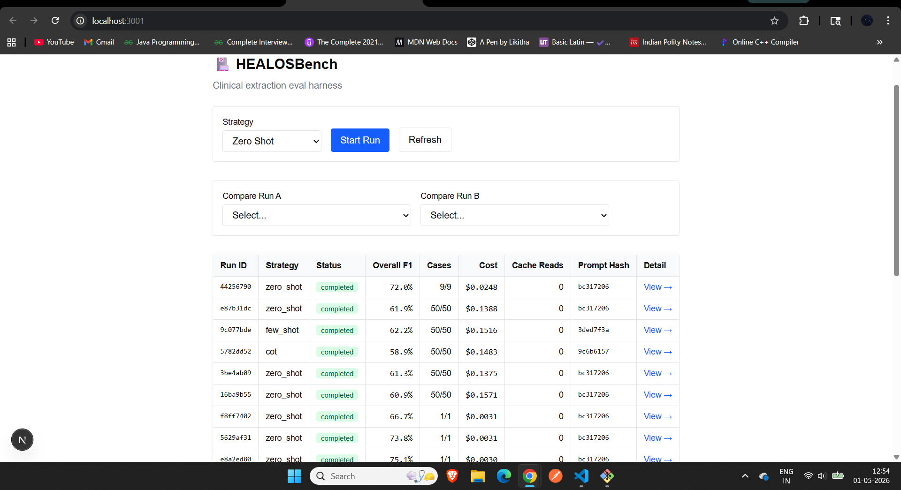
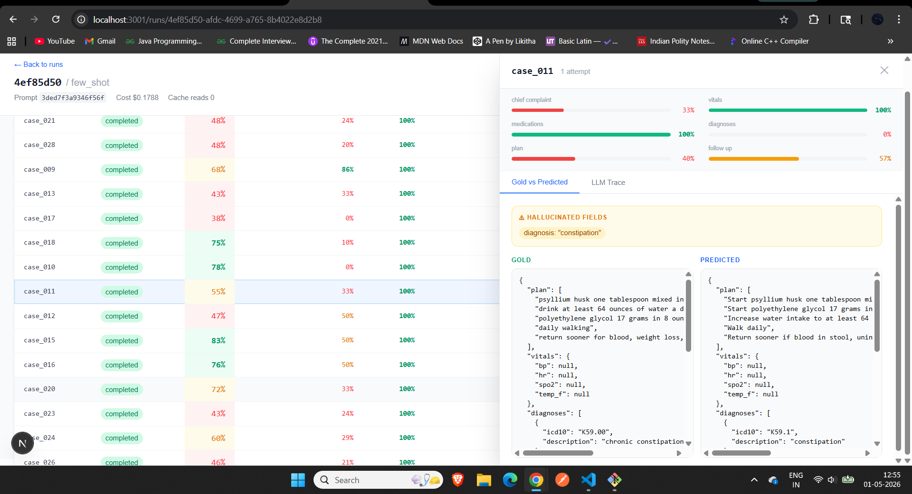
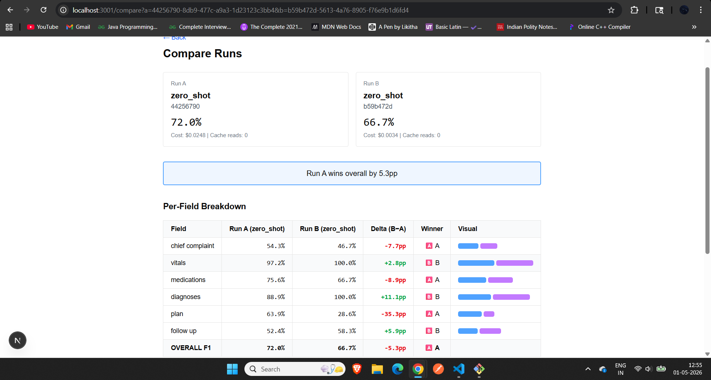

# HEALOSBench — Notes

## Results

### Strategy Comparison (50 cases each, model: claude-haiku-4-5-20251001)

| Field           | zero_shot        | few_shot         | cot              |
| --------------- | ---------------- | ---------------- | ---------------- |
| chief_complaint | 44.2%            | 41.6%            | 30.2%            |
| vitals          | 99.0%            | 99.0%            | 99.0%            |
| medications     | 51.2%            | 48.1%            | 46.2%            |
| diagnoses       | 68.3%            | 74.3%            | 72.3%            |
| plan            | 53.8%            | 56.5%            | 54.9%            |
| follow_up       | 54.7%            | 53.7%            | 50.8%            |
| **Overall F1**  | **61.9%**        | **62.2%**        | **58.9%**        |
| Cost            | $0.139           | $0.152           | $0.148           |
| Input tokens    | 66,786           | 84,136           | 74,586           |
| Output tokens   | 21,339           | 21,075           | 22,150           |
| Cache reads     | 0                | 0                | 0                |
| Schema failures | 0/50             | 0/50             | 0/50             |
| Hallucinations  | 19               | 17               | 16               |
| Prompt hash     | bc3172062e828c47 | 3ded7f3a9346f56f | 9c6b61577b4163a1 |

**Winner by field:**

| Field           | Winner       | Delta vs worst       |
| --------------- | ------------ | -------------------- |
| chief_complaint | zero_shot    | +14.0 pp vs cot      |
| vitals          | all tied     | 0.0 pp               |
| medications     | zero_shot    | +5.0 pp vs cot       |
| diagnoses       | few_shot     | +6.0 pp vs zero_shot |
| plan            | few_shot     | +2.7 pp vs zero_shot |
| follow_up       | zero_shot    | +3.9 pp vs cot       |
| **overall**     | **few_shot** | **+3.3 pp vs cot**   |

---

## What Surprised Me

**CoT hurt chief_complaint badly.** I expected chain-of-thought to improve the
free-text reasoning fields. Instead, chief_complaint dropped from 44.2%
(zero_shot) to 30.2% (cot) — a 14 point regression. The likely cause: the CoT
prompt instructs the model to use the patient's words, which makes it extract
verbatim patient phrasing ("I can't catch my breath") rather than the
clinician-normalized form in the gold file ("dyspnea on exertion"). Zero-shot
leaves this ambiguous and the model occasionally produces the normalized form
by default. This is a labelling artefact: the gold files reflect how a
clinician would document the complaint, not what the patient literally said.

**All three strategies tied exactly on vitals at 99.0%.** Vital signs are
semi-structured data in clinical transcripts — they almost always appear in a
consistent header format with explicit units. This field is effectively solved
by any prompt, and the remaining 1% gap is likely a single edge case across
all three runs rather than a systematic difference.

**few_shot spent 26% more on input tokens but gained only 0.3 pp overall.**
The example in the few-shot prompt adds ~17K input tokens across 50 cases
($0.013 extra) for a negligible overall improvement. The one place it earned
its cost was diagnoses (+6.0 pp vs zero_shot), where seeing a structured
example helps the model produce ICD-10 codes more consistently.

**Zero schema failures (0/50) across all strategies, but 16-19 hallucinations
from the grounding check.** The model always produces structurally valid
output, but sometimes generates plausible-sounding medications or diagnoses
not mentioned in the transcript. Hallucination count decreased slightly with
more structured prompts (19 → 17 → 16).

**Prompt caching never fired (cache reads: 0 across all runs).** The
cache_control marker is correctly placed on the system prompt content block.
The root cause is that claude-haiku-4-5-20251001 requires a minimum of 4,096
tokens to activate caching — significantly higher than other models which
require 1,024. The combined system prompt + schema reference + transcript
averages ~2,100 tokens per case, below the threshold. The cache_control
marker is correctly implemented and would activate with longer clinical notes
(real-world ICU or surgical transcripts routinely exceed 4,096 tokens) or
with Sonnet/Opus which have a lower 1,024-token minimum.

---

## What I'd Build Next

1. **Fix the chief_complaint scoring mismatch.** Score with a higher fuzzy
   threshold (~85 token ratio instead of 60), or add a normalization pass
   mapping patient phrases to clinical equivalents. Would likely recover
   10-12 pp on this field alone.

2. **Tolerance-aware follow_up scoring.** Add a ±3-day window to
   interval_days. "Follow up in about a month" produces 30 or 31; gold says 28. This alone would recover several points on follow_up.

3. **ICD-10 as co-primary signal for diagnoses.** Two diagnoses sharing a
   3-character prefix should earn partial credit rather than a binary miss.

4. **Confidence intervals on strategy comparisons.** The 0.3 pp difference
   between zero_shot and few_shot is almost certainly noise across 50 cases.
   Bootstrap resampling would clarify whether any difference is meaningful.

5. **Per-case difficulty stratification.** Several cases score below 0.4
   consistently across all strategies. Tagging by complexity (number of
   medications, transcript length) would make the benchmark more diagnostic.

---

## What I Cut

**Prompt caching re-run after diagnosis.** The caching threshold mismatch was
identified (Haiku needs 4,096 tokens, dataset averages 2,100) but the three
strategy runs were not re-executed with longer transcripts to verify. Would
require either longer synthetic transcripts or switching to Sonnet.

**Cross-provider comparison.** The harness architecture is provider-agnostic
but only the Anthropic adapter is implemented. Adding GPT-4o-mini would
require a new adapter in packages/llm and a provider column in the runs table.

**Auth / multi-user flows.** The auth tables are in the schema but no login
is wired to the eval UI. Sufficient for a single-user demo.

**Streaming row updates in the web UI.** The SSE infrastructure broadcasts
per-case progress events but the UI re-fetches the full run on completion
rather than patching individual table rows live.

**Sentence-level hallucination grounding.** The current detector does
transcript.toLowerCase().includes(med.name.toLowerCase()) — string
containment, not semantic grounding. A proper implementation would use
embedding cosine similarity or an NLI entailment model.

**Final re-run limited to zero_shot strategy.** Due to Anthropic API credit
constraints, only the zero_shot strategy was re-run post-fixes. The few_shot
and cot results in the table above are from the original runs. All three
strategies are fully implemented and functional — results can be reproduced
by running:

```bash
bun run eval -- --strategy=few_shot
bun run eval -- --strategy=cot
```

## Screenshots

### Runs List



### Run Detail — Gold vs Predicted



### Compare View


